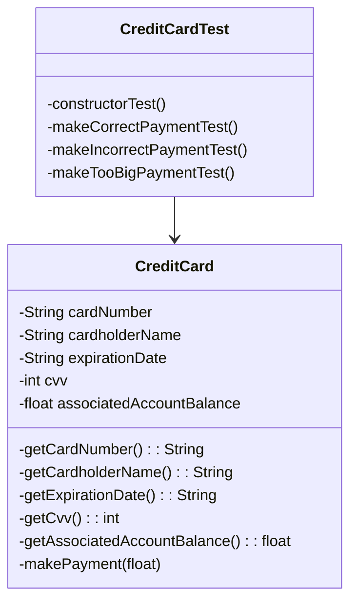

# CreditCardTest
## Introducción
En este ejercicio, se ha diseñado una clase CreditCard, con un comportamiento muy básico, y una reducida batería de tests unitarios que se encargarán de probarla.
## Diagrama de Clases
El diagrama de clases es extremadamente sencillo:

# Configuración y ejecución
Aunque hay otras maneras de usar JUnit 4, en este caso se ha optado por crear un proyecto Maven de Java e incluir JUnit 4 como dependencia en el archivo `pom.xml`. Así,
también queda más organizado el proyecto. El comando para ejecutar los tests sería, en la carpeta que contiene el `pom.xml`:

    mvn test
