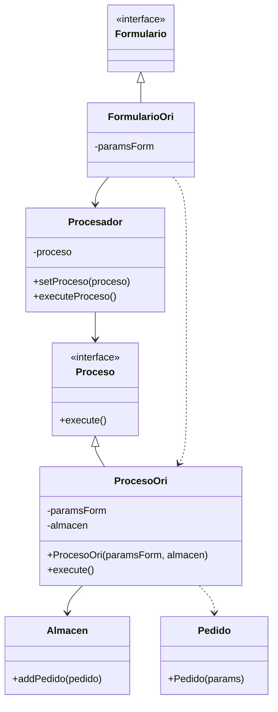
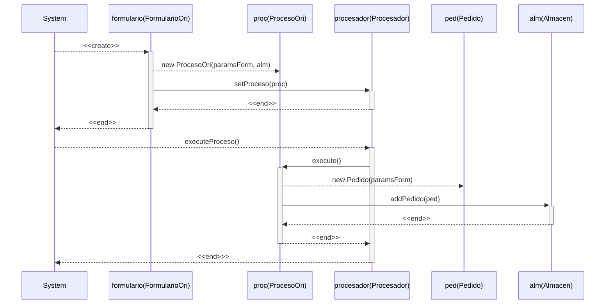
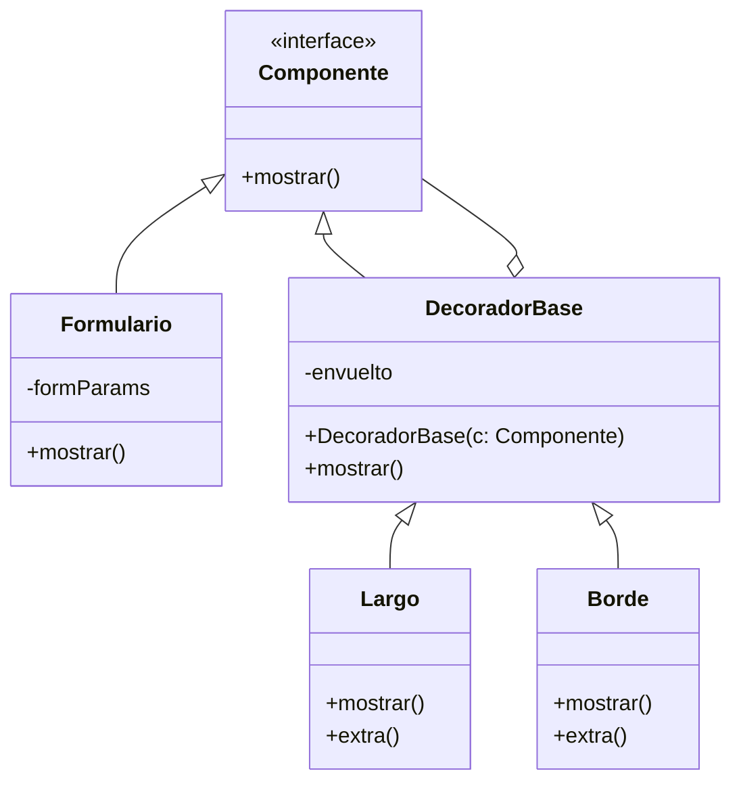

# Ejercicio de patrones - Distribuidora
## Apartado 1
Se presenta el siguiente diagrama de clases definiendo la estructura de las clases siguiendo el patrón de diseño `command`:

Ante la posible aparición de un nuevo tipo de formulario, bastaría con crear otra subclase de `Formulario` que represente al nuevo tipo de formulario, y una nueva subclase de `Proceso`, que recogerá el comportamiento del sistema ante el nuevo formulario.

## Apartado 2
El diagrama de secuencia generado es el siguiente:

## Apartado 3
Se puede realizar el diseño propuesto utilizando el patrón de diseño `decorator`. De esta manera, cada posible formulario tendría varios decoradores, en función de si necesitan barra desplazadora, bordes, etc. Un ejemplo de diseño sería el siguiente:

