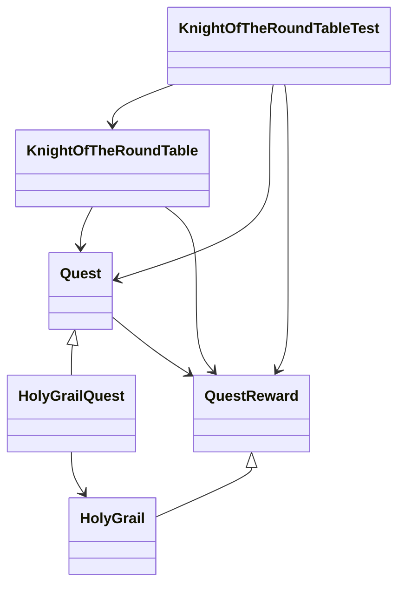

# Introducción
En este ejercicio, se ha usado el framework Spring en su versión Spring-context para realizar la inyección de dependencias necesarias para eliminar los acoplamientos indeseados.

# Beans
A continuación se muestran las Beans que se han creado para este ejercicio, para el uso de Spring:

[Beans.xml](knightoftheroundtable/src/main/java/Beans.xml)
```xml
<?xml version="1.0" encoding="UTF-8"?>
<!DOCTYPE beans PUBLIC "-//SPRING//DTD BEAN//EN"
"http://www.springframework.org/dtd/spring-beans.dtd">

<beans>
    <bean id="QuestType" class="es.uca.dss.examples.HolyGrailQuest"/>
    <bean id="Knight" class="es.uca.dss.examples.KnightOfTheRoundTable" scope="prototype"/>
</beans>
```
Que se instancian de la siguiente manera:

[KnightOfTheRoundTableTest.java](knightoftheroundtable/src/test/java/es/uca/dss/examples/KnightOfTheRoundTableTest.java)
```java
//Configuration
        String KnightName = "Lancelot";
        ApplicationContext context = new ClassPathXmlApplicationContext("Beans.xml");
        Quest quest = (Quest) context.getBean("QuestType");
        KnightOfTheRoundTable knight = (KnightOfTheRoundTable) context.getBean("Knight", KnightName, quest);
        ((ClassPathXmlApplicationContext) context).close();
```

# Diagrama de clases
Este es el diagrama resultante:



Aunque a simple vista se ven muchos acoplamientos, realmente no son acoplamientos negativos, ya que la inyección de dependencias se ha realizado de forma correcta. De esta manera, la clase `KnightOfTheRoundTable` no depende de ninguna clase concreta, sino que depende de dos interfaces, `Quest` y `QuestReward`. De esta manera, si se quiere cambiar la clase `HolyGrailQuest` o `HolyGrail` por otras que implemente la misma interfaz, no habrá ningún problema. Lo mismo ocurre con la clase `KnightOfTheRoundTableTest`, que depende de las interfaces `Quest` y `QuestReward`, y no de las clases concretas `HolyGrailQuest` y `HolyGrail`, además de la clase concreta `KnightOfTheRoundTable`, evidentemente.

Por último, destacar que la clase `HolyGrailQuest` si tiene una dependencia directa con la clase `HolyGrail`, ya que no se ha inyectado la dependencia, sino que se devuelve directamente, puesto que esta misión siempre va a devolver el mismo tipo de recompensa, evidentemente.

Así, si en un futuro los caballeros de la mesa redonda quieren cambiar la misión que tienen que realizar, o la recompensa que obtienen, no habrá ningún problema, ya que no dependen de ninguna clase concreta, sino de interfaces, y por tanto, se pueden cambiar las clases concretas que implementen dichas interfaces a misiones como `SlainDragon`.